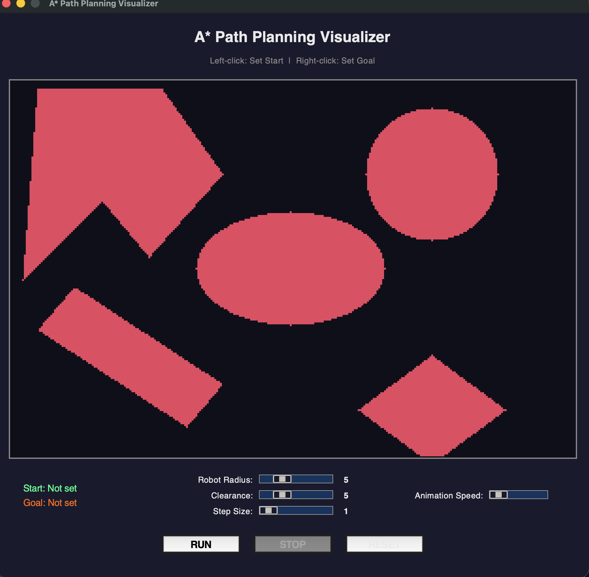
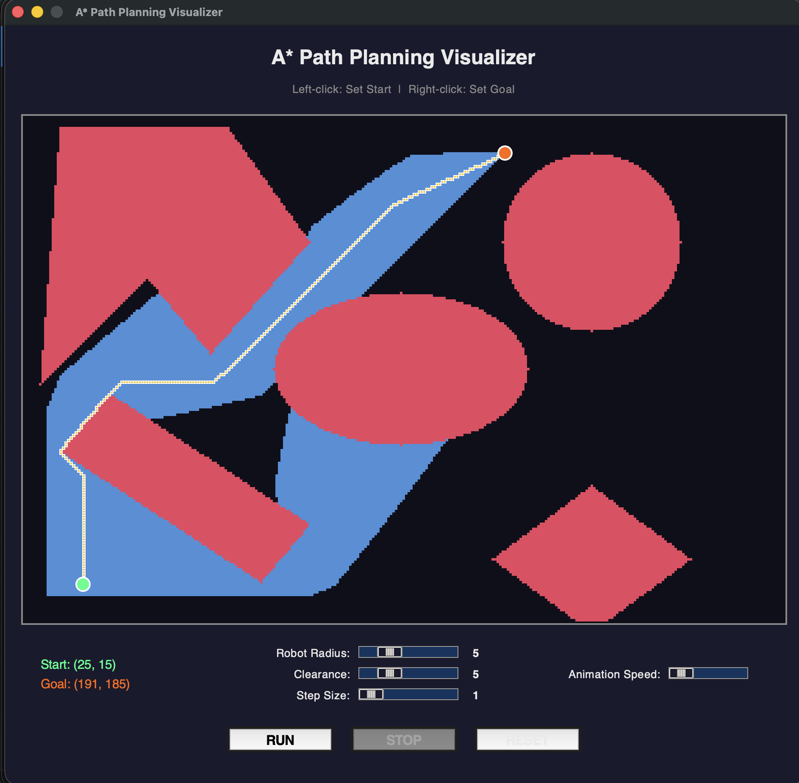

# Path Planning using A-star Algorithm

[]
---


### Author
Ofek Danny


### Introduction to the Project
In this project, the A-star motion planning algorithm was used on a point robot and rigid robot to navigate in a configuration space consisting of static obstacles.


### Features

- **Interactive GUI**: A modern dark-themed graphical interface built with tkinter
- **Click-to-Set Points**: Left-click to set start point, right-click to set goal point
- **Real-time Visualization**: Watch the A* algorithm explore the space and find the optimal path
- **Adjustable Parameters**:
  - Robot Radius
  - Clearance
  - Step Size
  - Animation Speed
- **Multiple Obstacle Types**: Circle, ellipse, triangles, rhombus, rectangle, and polygon obstacles


### Results

Interactive GUI showing the obstacle map:


A* algorithm visualization with explored region (blue) and optimal path (yellow/white):



### Software Required
To run the .py files, use Python 3. The following libraries are required:
- numpy
- OpenCV (cv2)
- tkinter (included with Python)
- heapq (included with Python)


### Instructions for running the code

#### GUI Mode (Recommended)
To run the interactive GUI visualizer:

```
cd Code
python gui_main.py
```

**How to use the GUI:**
1. Adjust robot radius, clearance, and step size using the sliders
2. Left-click on the canvas to set the start point (green)
3. Right-click on the canvas to set the goal point (orange)
4. Click "RUN" to start the A* path planning algorithm
5. Watch the exploration (blue) and optimal path (yellow) animate in real-time
6. Click "RESET" to clear and try again

#### Command Line Mode
To run the original command-line version:

```
cd Code
python astar.py
```

You will be prompted to enter:
- Start node coordinates (x, y)
- Goal node coordinates (x, y)
- Robot radius
- Clearance
- Step size


### Project Structure

```
Code/
├── astar.py        # Command-line A* implementation
├── utils.py        # AStar class with path planning logic
├── gui_main.py     # Main GUI application entry point
├── gui_canvas.py   # Canvas rendering for visualization
└── gui_config.py   # GUI configuration and color scheme
```


